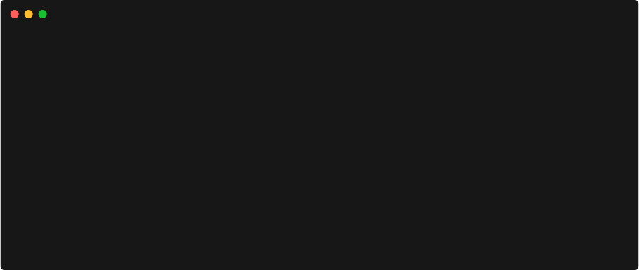

##### shellback: reverse shell generator
[](https://github.com/chrispetrou/shellback/blob/master/LICENSE) 
[](https://www.python.org/)
[](https://snyk.io//test/github/chrispetrou/shellback?targetFile=requirements.txt)

* * *



Shellback is a standalone python script to automate the process of generating a reverse-shell command like those described in [pentestmonkey](http://pentestmonkey.net/cheat-sheet/shells/reverse-shell-cheat-sheet) blog.

__Compatibility:__ 
*   The `shellback.py` script is compatible with **python 2.x** and 
*   the `/py3_version/shellback.py` is compatible with **python3.x**.

##### ► Supported reverse shells (-v option)
__default__: `bash`

Reverse shells |
|-|
| bash |
| perl |
| python |
| php |
| ruby |
| nc1 (nc version 1)|
| nc2 (nc version 2)|
| java |

##### ► Supported shell types (-s option) 
__default__: `/bin/sh`

In some cases it is possible to specify the shell type. The supported shell-types are the following:

Shell types |
|-|
| sh |
| zsh |
| ksh |
| tcsh |
| bash |
| dash |

> This script was originally part of the scripts in my [pypentesting-repository](https://github.com/chrispetrou/pypentesting#revshell), but since I tend to use a lot on CTF-like challenges and pentesting labs I decided to create a separate repository for it.

#### Requirements:
To install the requirements:
```
pip install -r requirements.txt --upgrade --user
```

#### :thought_balloon: Contributions & Feedback

Feedback and contributions are welcome. If you find any bug or have a feature request feel free to open an issue, and as soon as I review it I'll try to fix it.

### Disclaimer
> This tool is only for testing and academic purposes and can only be used where strict consent has been given. Do not use it for illegal purposes! It is the end user’s responsibility to obey all applicable local, state and federal laws. Developers assume no liability and are not responsible for any misuse or damage caused by this tool and software.

### Credits

*   The shellback logo is made with [fontmeme.com](https://fontmeme.com/graffiti-fonts/)!

## License

This project is licensed under the GPLv3 License - see the [LICENSE](LICENSE) file for details